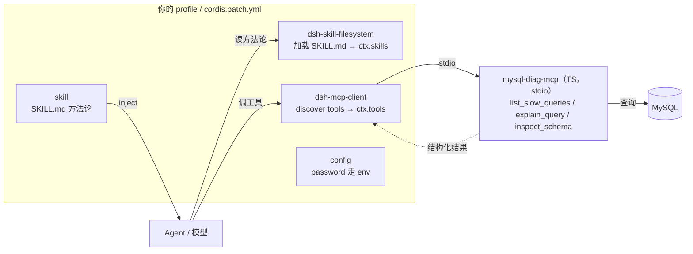

# MySQL 慢查询分析 —— 实施方案（Spec v2）

> 状态：核心决策已确认，待开始实施
> 场景：OmniOps 第一个 AIOps 智能运维诊断能力 —— MySQL 慢查询分析
> 载体：**MCP 方式**（数据采集）+ **skill**（排查方法论）+ **组合层**（统筹）

---

## 0. 已拍板的决策

| 项 | 决策 |
|---|---|
| MCP server 语言 | **TypeScript** |
| MVP 工具范围 | **3 个**：慢日志分析 → 执行计划 → 表结构/索引 |
| skill | **一起做** |
| bundle 打包 | **暂缓**，测试完成后再打包分发 |
| DSN 凭据 | host/port/user/db 走**对话入参**，password 走 **env**（见 2.4，理由见下） |
| 交互格式 | 用户提供 **ip / port + 描述任务**（见 2.3） |

---

## 1. 整体实现架构

### 1.1 「一切皆插件」是怎么实现的

dsh 是建立在 vendored Cordis 上的插件化 agent harness，运行时是一个**插件树（plugin tree）**：

- 没有任何特权核心。模型适配器、工具注册表、会话日志、agent loop 本身都是插件。
- 每个插件向共享 `context`（`ctx`）贡献 **service / typed events / 可逆 effect**；卸载即撤销（`Registrations are effects`）。
- 插件之间**不互相 import**，只通过共享 `ctx`、事件流、注册表协作。组合关系完全由 `cordis.yml` 声明。

### 1.2 三个独立单元（不是一个大插件）

| 单元 | 形态 | 职责 | 要写吗 |
|---|---|---|---|
| 排查方法论 | **skill**（`SKILL.md` 文件） | 告诉模型怎么查、按什么步骤、调哪个工具 | ✅ 写一个文件 |
| 数据采集 | **MCP server**（TypeScript 独立进程） | 连 MySQL，暴露 3 个 tool | ✅ 写一个 server |
| 接入层 | 复用 `@deepseek-ai/dsh-mcp-client` + 配置 | 把 MCP 工具注册进 `ctx.tools` | ❌ 复用 |

### 1.3 统筹靠组合层

`cordis.patch.yml` / `preset` / `bundle` 是「组合层」：把 skill 加载、MCP 接入、config 拼成一份配置。用户在自己的 profile 的 `cordis.patch.yml` 引用这个组合（或加两行），就同时获得「方法论 + 采集工具」。

### 1.4 架构图



---

## 2. 组件设计

### 2.1 MCP server：`mysql-diag-mcp`（TypeScript）

- **传输**：`streamable-http`（server 独立常驻，`dsh-mcp-client` 通过 URL 连接，便于将来跨机器）。用 MCP SDK 的 `StreamableHTTPServerTransport`（无状态模式），监听 `host:port` 由 `MCP_HTTP_HOST` / `MCP_HTTP_PORT` 环境变量配置（默认 `127.0.0.1:8080`）。
- **依赖**：MySQL 驱动用 `mysql2`（`explain_query`/`inspect_schema` 连库用），MCP 协议用 `@modelcontextprotocol/sdk`，慢日志分析用外部工具 `pt-query-digest`。
- **MVP 工具（3 个）**：

| 工具名 | 作用 | 数据来源 |
|---|---|---|
| `list_slow_queries` | 慢日志分析：调 pt-query-digest 分析慢日志目录（自动按时间段挑文件、复制到临时目录），返回 Top N SQL 报告 | `pt-query-digest <慢日志目录>` |
| `explain_query` | 执行计划：对给定 SQL 返回 EXPLAIN（type/key/rows/Extra） | `EXPLAIN` / `EXPLAIN ANALYZE` |
| `inspect_schema` | 表结构 + 索引：列/类型/键 + 索引名/列/基数/选择性 | `information_schema.columns` + `information_schema.statistics` |

- **连接参数**：`explain_query`/`inspect_schema` 接受 `connection: { host, port? }`——只从用户输入提取 ip/port；`user`/`password` 从环境变量 `MYSQL_USER`/`MYSQL_PASSWORD` 读，`database` 从 pt-query-digest 报告的 `# Databases` 字段读取（模型提取后传入）、缺省取环境变量 `MYSQL_DATABASE`。
- **`list_slow_queries` 不连库**：只调 `pt-query-digest` 分析慢日志目录，入参是慢日志目录路径 + 时间段 + Top N（内部自动按时间段挑文件、复制到临时目录分析，不动原文件）。**慢日志目录与 pt-query-digest 路径均可配置**（环境变量 `MYSQL_SLOW_LOG_DIR` / `PT_QUERY_DIGEST` 或工具入参），不写死。

### 2.2 skill：`mysql-slow-query-analysis`（SKILL.md）

- **frontmatter**：`name` + `description`（模型按它路由）。
- **正文（方法论）**：
  1. 从用户输入提取 host（ip）/port + 时间段；user/password/database 从环境变量或慢 SQL 解析；
  2. 调 `list_slow_queries`（pt-query-digest）找 Top 慢 SQL；
  3. 对候选逐条调 `explain_query` 看执行计划；
  4. 调 `inspect_schema` 看表结构 + 索引分布；
  5. 综合归因（全表扫描 / 缺索引 / 类型转换 / 数据量）并给优化建议 + 预期收益。
- **加载**：由 `@deepseek-ai/dsh-skill-filesystem` 从 skill 目录发现并注册进 `ctx.skills`。skill 是**文件，不是插件**。

### 2.3 交互格式

用户发起诊断的统一格式（含明确时间段）：

```
帮我分析 <ip>:<port> 的慢查询，时间段：2026-08-10 10:00:01 到 2026-08-10 11:00:01
```

- `ip` / `port`：用户在对话中提供，模型提取后作为 tool 的 `connection` 入参。
- `时间段`：起止时间作为 `list_slow_queries` 的 `since` / `until` 入参（`YYYY-MM-DD HH:mm:ss`）。
- `user` / `password`：配置项，从环境变量读，不进对话、不进 tool 入参（避免进入 session log）。
- `database`：从慢查询报告的 `# Databases` 字段读取，缺省取环境变量 `MYSQL_DATABASE`，不要求用户在对话中提供。

> 注意：慢日志分析**不查表**，改用 `pt-query-digest` 分析慢日志文件（`log_output='FILE'`）。慢日志文件路径与 pt-query-digest 路径均通过环境变量或工具入参配置，不写死。见操作手册 S1。

### 2.4 接入配置 + 凭据决策

```yaml
# 1) 加载 skill（profile 通常已含 skill-filesystem，只需指向 skill 目录）
- id: skill-filesystem
  name: '@deepseek-ai/dsh-skill-filesystem'
  config:
    customSkillDirs:
      - skills            # 项目内 skill 根目录

# 2) 接入 MCP server（复用通用 client，走 streamable-http）
- id: mysql-diag
  name: '@deepseek-ai/dsh-mcp-client'
  config:
    serverName: mysql_diag
    transport: streamable-http
    url: http://127.0.0.1:8080/mcp
    headers: {}
```

**凭据与路径决策（第 5 项）**：`host/port` 由用户在对话中给出（非敏感、可现场换实例），作为 tool 入参；`user`/`password`/`database`（默认库）与慢日志路径、pt-query-digest 路径都从**启动 server 进程的环境变量**读取（HTTP 方式下 server 独立常驻，不由 dsh 转发），其中 `database` 优先从报告的 `# Databases` 字段读取。**理由**：密码一旦作为 tool 入参就会进 session log（dsh 的「model-visible means logged」），有泄露风险；用户名/默认库/路径随部署环境变化，走 env 配置即可、不写死在代码里。server 监听 `host:port` 也通过 `MCP_HTTP_HOST` / `MCP_HTTP_PORT` 环境变量配置（默认 `127.0.0.1:8080`）。

---

## 3. FAQ：下拉框选中「慢查询分析」，调的是 skill 吗？

**不直接调 skill。** 完整链路是这样的：

1. 首页下拉框「技术栈 → MySQL → 慢查询分析」目前**只改 React state**，不触发任何逻辑；
2. 你在输入框描述任务（如「分析 10.0.0.5:3306 的慢查询」）并提交；
3. 提交时，需要把「选中的诊断技能 = 慢查询分析」这个信号**一起传给模型**（这是要补的一层联动，见下）；
4. 模型根据 skill 的 `description` **决定 invoke 该 skill**（progressive disclosure）；
5. skill 内容（方法论）被 `inject()` 进上下文；
6. 模型按方法论去调 MCP 工具，产出诊断报告。

**skill 要不要写成插件安装？——不用。** skill 是 `SKILL.md` 文件，由现成的 `dsh-skill-filesystem` 加载注册进 `ctx.skills`。你要做的只有：
1. 写一个 `SKILL.md` 放到 skill 目录；
2. 确保 profile 挂了 `dsh-skill-filesystem`（base bundle 已含，通常无需额外装）。

**真正要「新开发 + 接入」的只有 MCP server**（TypeScript stdio 进程），而接入它也只需一行 `dsh-mcp-client` 配置，不是写插件。

### 3.1 下拉框联动（需补的一层）

要让「选中慢查询分析」真正生效，需在**用户提交消息时**把选中项传给模型，两种做法：

- **方案 A（轻量）**：前端在 composer 提交时，把选中的 skill 名拼进首条消息（或作为预设 prompt），例如前置一句「使用 `mysql-slow-query-analysis` 技能」。改动集中在 `ConversationRoot.tsx`。
- **方案 B（更规范）**：写一个插件监听提交，`agent.inject({ content: "当前诊断技能：慢查询分析 …", source: ... })` 注入上下文，或直接触发 skill invoke。

MVP 建议先做**方案 A**（改动最小、可验收），方案 B 作为后续规范化。

---

## 4. 开发步骤

| 阶段 | 内容 | 验收 |
|---|---|---|
| S1 | 开发 `mysql-diag-mcp`（TS）：3 个 tool、连真实 MySQL、结构化返回、独立单测 | server 单独跑通 |
| S2 | 写 `SKILL.md` 方法论（含提取连接信息、三步诊断流程、输出格式） | 内容评审通过 |
| S3 | `cordis.patch.yml` 组合：接 `dsh-mcp-client` + 指向 skill 目录，password 走 env | 模型能调起工具 |
| S4 | 下拉框联动（方案 A）：提交时把选中 skill 传给模型 | 选中即走对应诊断 |
| S5 | snapshot 测试（mock MCP server 回放）+ 联调 | 快照通过 |
| S6 | 双语文档 + Agent Note | 门禁通过 |
| S7 | （测试全绿后）打包 bundle 供一键分发 | 用户 mount 即得能力 |

S1 / S2 可并行；S4 依赖 S2；S7 在 S5 之后。

---

## 5. 测试与仓库门禁

- MCP server：3 个 tool 各自单测（连真实 MySQL 或 fixture）。
- 接入层：mock MCP server 做 keyless snapshot。
- 文档：README 双语 + i18n 映射；Agent Note。

---

## 6. 遗留待定（实施中再定）

- MCP server 打包形态（`bin` 入口 + 发布方式），S7 与 bundle 一起定。
- 密码若需按实例不同，后续可引入 `credentials` 引用；MVP 先用统一 env。
